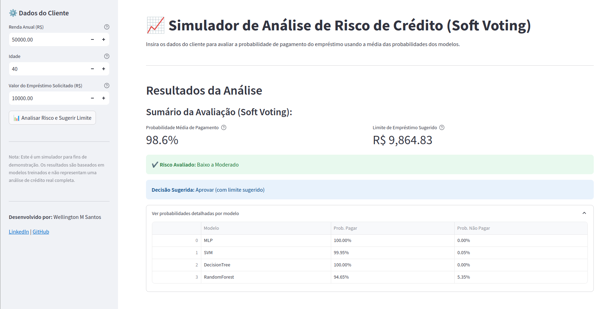

# Simulador de Análise de Risco de Crédito (Loan Default Predictor)

## Visão Geral
Este projeto implementa um simulador web interativo, construído com Streamlit, para avaliar o risco de inadimplência em empréstimos. A ferramenta utiliza um ensemble de modelos de Machine Learning (MLP, SVM, Decision Tree, Random Forest) previamente treinados e otimizados para calcular a probabilidade de um cliente pagar um empréstimo com base em sua renda, idade e valor solicitado.



## Funcionalidades

*   **Interface Interativa:** Permite que um usuário (simulando um gerente de banco) insira os dados do cliente (renda, idade, empréstimo).
*   **Previsão Ensemble (Soft Voting):** Utiliza 4 modelos de ML (MLP, SVM, DT, RF) para prever a probabilidade de pagamento. Calcula a média das probabilidades (Soft Voting) para uma decisão mais robusta.
*   **Cálculo de Limite Sugerido:** Com base na probabilidade média de pagamento, sugere um limite de empréstimo proporcional ao valor solicitado.
*   **Avaliação de Risco:** Classifica o risco percebido (Baixo/Moderado, Moderado/Alto, Alto) com base na probabilidade de pagamento.
*   **Detalhes por Modelo:** Oferece a opção de visualizar as probabilidades individuais calculadas por cada modelo no ensemble.
*   **Logging:** Utiliza o módulo `logging` para registrar informações sobre a execução e potenciais erros.

## Metodologia dos Modelos (Treinamento Prévio)

Os modelos utilizados nesta aplicação foram desenvolvidos em um projeto anterior, seguindo as etapas:

1.  **Análise Exploratória e Limpeza:** Tratamento de dados ausentes e inválidos (idades negativas) no dataset `credit_data.csv`.
2.  **Pré-processamento:** Escalonamento das features (`StandardScaler`).
3.  **Treinamento e Otimização:** Diversos classificadores foram treinados e tiveram seus hiperparâmetros otimizados via `GridSearchCV`.
4.  **Avaliação Robusta:** Validação Cruzada Repetida (30x) e testes estatísticos (ANOVA, Tukey HSD) foram usados para selecionar os modelos mais performáticos e estáveis.
5.  **Modelos Selecionados:** MLP, SVM, Decision Tree e Random Forest foram escolhidos e salvos.

*Para detalhes completos sobre o treinamento e avaliação dos modelos, consulte o projeto original disponível em:* [loan default prediction](https://github.com/esscova/ML-DL/tree/main/loan%20default%20prediction)

## Estrutura do Projeto

```
simulador-de-emprestimos/
├── data/                   # Dados e modelos necessários para a app
│   ├── models/             # Modelos .joblib finais
│   │   ├── mlp.joblib
│   │   ├── svm.joblib
│   │   ├── dt.joblib
│   │   └── rf.joblib
│   └── train_test.joblib   # Dados para ajustar o Scaler
│
├── src/                    # Código fonte da lógica da aplicação
│   ├── __init__.py
│   ├── config.py         # Constantes e configurações
│   └── services/           # Módulos de serviço
│       ├── __init__.py
│       ├── data_processing.py # Carrega e ajusta o Scaler
│       ├── model_loader.py     # Carrega os modelos .joblib
│       └── prediction.py       # Lógica de pré-processamento e Soft Voting
│
├── app.py                  # Arquivo principal da interface Streamlit
├── requirements.txt        # Dependências Python
└── README.md               # Este arquivo
```

## Tecnologias Utilizadas

*   **Linguagem:** Python 3
*   **Interface Web:** Streamlit
*   **Machine Learning:** Scikit-learn
*   **Manipulação de Dados:** Pandas, NumPy
*   **Persistência de Modelos:** Joblib
*   **Logging:** Módulo logging do Python

## Configuração e Instalação

1.  **Clone o Repositório:**
    ```bash
    git clone https://github.com/esscova/simulador-de-emprestimos.git
    cd simulador-de-emprestimos
    ```
2.  **Crie um Ambiente Virtual (Recomendado):**
    ```bash
    python -m venv venv
    source venv/bin/activate  # Linux/macOS
    # venv\Scripts\activate  # Windows
    ```
3.  **Instale as Dependências:**
    ```bash
    pip install -r requirements.txt
    ```

## Como Executar

Após a instalação, execute o seguinte comando no terminal, dentro do diretório raiz do projeto (`simulador-de-emprestimos/`):

```bash
streamlit run app.py
```

A aplicação será aberta automaticamente no seu navegador web padrão.

## Contato

Desenvolvido por **Wellington Moreira Santos**

*   **LinkedIn:** [linkedin.com/in/wellington-moreira-santos](https://www.linkedin.com/in/wellington-moreira-santos/)
*   **GitHub:** [github.com/esscova](https://github.com/esscova)